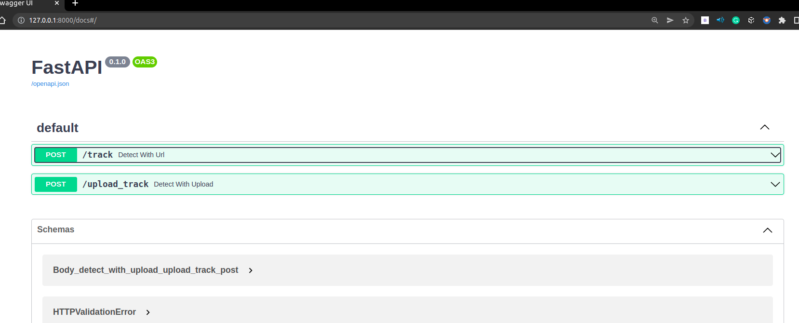

# Aive Technical Assessment: Human Tracker
## Computervision Models: Yolov5 + StrongSORT with OSNet


<p>
 
</p>
<br>


## Introduction

This repository contains a highly configurable two-stage-tracker that adjusts to different deployment scenarios. It is based on the work by [mikel-brostrom repo](https://github.com/mikel-brostrom/Yolov5_StrongSORT_OSNet).
<br>
## The main parts of the repo include:
* **Notebooks**: 3 notebooks:<br> - ipynb notebook for data scraping to collect a dataset for training. <br> - ipynb notebook to load the dataset from Roboflow and train a Yolov5 model. As well as a tensorboard to evaluate the train/val/test mAP scores.<br> - ipynb notebook to perform an inference on the commercial video.  

* **Yolov5** : a github repo cloned from [YOLOv5](https://github.com/ultralytics/yolov5). It is an object detection algorithm that divides images into a grid system. Each cell in the grid is responsible for detecting objects within itself.
YOLO is one of the most famous object detection algorithms due to its speed and accuracy.
I trained the model on a small scraped dataset to on google colab using Tesla P4 as gpu but noticed that the weights that are pretrained on COCO dataset performed way better. So I moved forward with the latter to perform the tracking.
* **Trackers**: 
A package that has a set of models. they are able to track any object that Yolov5 was able to detect. I used StrongSort for the tracking.[StrongSORT](https://github.com/dyhBUPT/StrongSORT)[](https://arxiv.org/pdf/2202.13514.pdf) on [OSNet](https://github.com/KaiyangZhou/deep-person-reid)[](https://arxiv.org/abs/1905.00953). Omni-Scale Feature Learning for Person Re-Identification.
* **track.py**: a python file that helps us the generate the tracking. it has several parameters as follow:
<br> --source: the path of the video or URL
<br> --yolo-weights: path to the pretrained yolov5 weights
<br> --reid-weights: path to the pretrained OSnet weights
<br> --classes : since the yolov5 was trained on cocodataset, we can choose which classes to keep. 0 is to detected the humans in the video.
<br> --save_txt: to save the boxplot coordinates and the number of detected people in the video in a txt file.
<br> --save-vid: in case we want to keep the video 
* server.py: backend implementation using FastAPI. it has two api endpoints. <br>
-"track" api is a post request,that gets a Youtube URL video and other parameters and return the video with the tracked objects.
<br>
-"track_upload" api is a post request in which we upload the video and the required inference params and provide us with the genenrated video of the tracked objects.

* **Inference parameters**:
 A pydantic BaseModel that encapsulates and test the validity of the parameters we'll pass to track.py to perform the tracking.
 The params are : the url for the video, whether or not to save the video, the class number of the object to track, whether to save the bounding box coordinates in a txt file or not.)

* **frontend**:
  a not finished web app frontend to consume the backend model. It has two options to load your own video or to send the URL of the video to track. each one is pointing to a different API. 
* *dockerfile*:
helps to genenrate docker image and consume it as a microservice.

## Applied Methodology:
### 1 Training Yolov5 on Custom dataset
#### 1.a scraped data from Bing: 
saved image searches of:
* Wide Shot with a person in the frame.
* Close Shot of a person. 
* Medium Shot of a person.
* Natalie Portman close Shot ( This might overfit the dataset on the commercial but I'll try to clean the dataset and only add a few images of her in teh datasett.)

The images will be saved in a private google Drive and then be imported to Roboflow for annotation and exporting  the dataset to yolov5 compatible type. 
Please note that I won't be scraping a large amount of images because the Annotation task later on is time consuming. 
 <p>
 
</p>
<br>

  #### 1.b Uploaded Data to Roboflow to annotate it, perform data processing and augmentation. As well as split train/validation/testing.
 <p>
 
</p>


#### 1.c export the dataset into a yolov5 compatible dataset format and use the Roboflow api to load the dataset for training the model.
<br>
 <p>
 
</p>
<br>

  #### 1.d train the model and validate it and load Tensorfboard to view mAP scores. 
 <p>
 
</p>
<br>

As you can notice, The dataset is limited. I tested the saved the weights on the detect.py the detection wasn't precise. So I continued working with Yolov5s weights.

### 2.detecting humans and tracking using Yolov5 + StrongSort:

Tracking can be run on most video formats
By default the tracker tracks all MS COCO classes.
to only detect the humans subset we add "--classes 0".
[Here](https://tech.amikelive.com/node-718/what-object-categories-labels-are-in-coco-dataset/) are the labels for each subclass 
It was recommend to use [these weights](https://drive.google.com/file/d/1gglIwqxaH2iTvy6lZlXuAcMpd_U0GCUb/view?usp=sharing)
for yolov5 for human crowd.

```bash
$ python track.py --source path/video.mp4  # video
                           'https://youtu.be/Zgi9g1ksQHc' #YouTube
                           --yolo-weights yolov5n.pt 
                           --reid-weights osnet_x0_25_market1501.pt 
                           --classes 0
                           --save-vid # video will be saved in runs/exp_i
                           --save-txt
                           


## Filter tracked classes
is a list of all the possible objects that a Yolov5 model trained on MS COCO can detect. Notice that the indexing for the classes in this repo starts at zero.


## MOT compliant results

Can be saved to your experiment folder `runs/track/<yolo_model>_<deep_sort_model>/` by 

```bash
python track.py --source ... --save-txt
```

### 3. Creating Backend with FastAPI and frontend with streamlit
  <br>
 <p>
 
</p>
<br>

  <br>
 <p>
 
</p>
<br>
  <br>
 <p>
 
</p>
<br>

### 4. dockerfile
the image is based on  ultralytics/yolov5:latest.
it will clone the module of StrongSort recursively
install the required libraries and make the fastAPI available for consumption.


## Tutorials
Links I used to learn how to 
* [train Yolov5](https://github.com/ultralytics/yolov5/wiki/Train-Custom-Data)&nbsp;
* [annotate images, split dataset into train/val/test and export it to yolov5 compatible format.and connect to Roboflow API to load the dataset](https://www.youtube.com/watch?v=x0ThXHbtqCQ&t=741s&ab_channel=Roboflow)

  
## Experiments

* [Yolov5 StrongSORT OSNet vs other trackers MOT17](https://github.com/mikel-brostrom/Yolov5_StrongSORT_OSNet/wiki/MOT-17-evaluation-(private-detector))&nbsp;
* [Effect of different Osnet architectures on MOT16](https://github.com/mikel-brostrom/Yolov5_StrongSORT_OSNet/wiki/OSNet-architecture-performances-on-MOT16)


## Before you run the project

1. Clone the repository recursively:

`git clone --recurse-submodules https://github.com/Medsabkhi21/Aive-project.git`

2.fulfill all the requirements: Python >=3.8  [requirements.txt](Aive-project/requirements.txt) dependencies installed, including torch>=1.7. To install, run:

`pip install -r requirements.txt`


## References


```latex
@misc{yolov5-strongsort-osnet-2022,
    title={Real-time multi-camera multi-object tracker using YOLOv5 and StrongSORT with OSNet},
    author={Mikel Broström},
    howpublished = {\url{https://github.com/mikel-brostrom/Yolov5_StrongSORT_OSNet}},
    year={2022}
}
```
